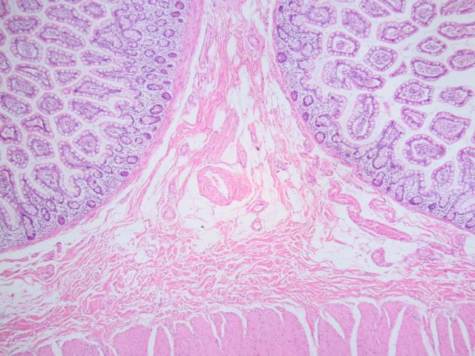
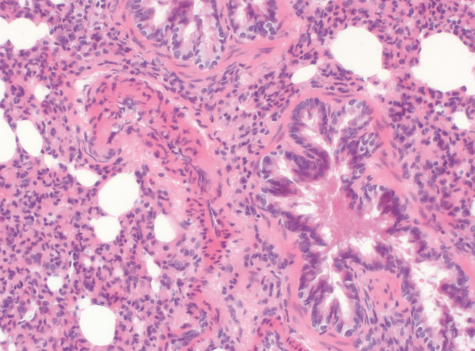
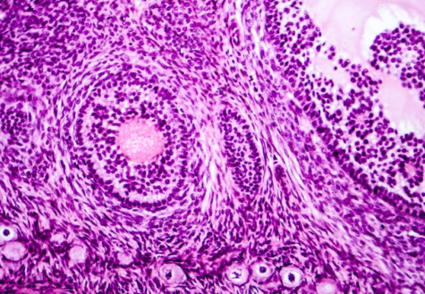
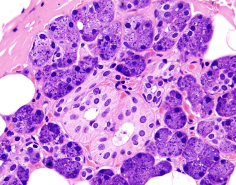

# Reinhard Color Transformation Project

## Description
This project implements the **Reinhard color transfer** method for stain normalization in digital pathology images. The technique normalizes colors across histopathology images to match a template/reference image, ensuring consistent coloring — a critical preprocessing step for machine learning and deep learning pipelines.

The method is based on the paper: [Color Transfer between Images](https://www.cs.tau.ac.il/~turkel/imagepapers/ColorTransfer.pdf)

## How It Works


The Reinhard color transformation operates through the following steps:

1. **Convert to LAB color space** — LAB separates luminance (L) from color channels (a, b), making it ideal for color manipulation.
2. **Compute statistics** — Calculate the mean and standard deviation of each LAB channel for both the source and template images.
3. **Normalize pixels** — For each pixel in each channel:

   `pixel_new = (pixel - source_mean) × (template_std / source_std) + template_mean`

4. **Clamp values** — Ensure pixel values remain within [0, 255].
5. **Convert back to BGR** — Transform the normalized LAB image back to BGR for saving.

## Input and Output Images

### Input Images (Original)
| Image 1 | Image 2 | Image 3 (Template) | Image 4 |
|---------|---------|---------------------|---------|
|  |  |  |  |

| Image 5 | Image 6 | Image 7 |
|---------|---------|---------|
|  |  |  |

### Output Images (Stain Normalized)
| Modified 1 | Modified 2 | Modified 3 | Modified 4 |
|------------|------------|------------|------------|
|  |  |  |  |

| Modified 5 | Modified 6 | Modified 7 |
|------------|------------|------------|
|  |  |  |

## Requirements
- Python 3.x
- OpenCV (`cv2`)
- NumPy

## Usage
Open and run the Jupyter notebook:
```bash
jupyter notebook "Reinhard Color Transformation.ipynb"
```

## Push to GitHub

```bash
cd "d:\Master in Genova_And_Others_Projects\Digital Patholpgy_Projects\Reinhard_Color transformation_Project"
git init
git remote add origin https://github.com/behnoudshafizadeh/Reinhard_Color-transformation_Project.git
git add .
git commit -m "Initial commit: Reinhard color transformation project"
git branch -M main
git push -u origin main
```

## License
This project is for educational and research purposes.
